# Trade Forecasting — a Bob + Confluent Cloud Lab

**Use case:** picture an online trading platform. Stock trades are streaming in
constantly, and the team wants two things live: who's trading and where they're
from (a **join**), and which stocks are surging in activity so they can spot
momentum as it builds (a **forecast**). In this lab you'll build exactly that —
entirely inside Confluent Cloud, no Terraform, no local setup.

**Why it matters:** forecasting lets the platform get ahead of a surge —
provision capacity, alert users, or flag manipulation *before* it peaks —
instead of reacting once it's already over.

**What makes this a *Bob* lab:** at every step you first tell **IBM Bob**, in
plain English, what you want — Bob writes the Flink SQL and explains the tricky
parts — then you run it in Confluent Cloud and confirm the result. You stay in
control; Bob is your pair-programmer.

> **Total time:** ~45–50 minutes.

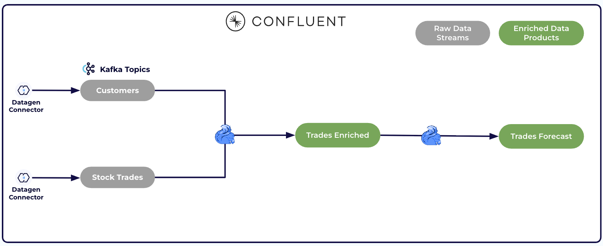

> This manual is adapted from Confluent's
> [`confluent-intelligence-trade-forecasting`](https://github.com/confluentinc/confluent-intelligence-trade-forecasting)
> lab (screenshots and base steps), rewoven as an AI-assisted **Bob + Confluent**
> workshop. The verified reference build and result are in [`LAB.md`](LAB.md);
> the per-stage pass/fail checklist is in [`VALIDATE_OUTPUT.md`](VALIDATE_OUTPUT.md).

---

## Before you start — meet Bob and load the skill

IBM Bob is an agentic AI assistant for the software lifecycle. In this lab Bob
plays one focused role: you describe the pipeline in plain English, and Bob
produces the Flink SQL, explains it, and helps you debug.

Bob writes sharper Confluent SQL when it has **this lab's skill** loaded. It
ships inside this repo at `.bob/skills/trade-forecasting-flink/SKILL.md`:

```bash
git clone https://github.com/EdySamaha/IBM-confluent-bob-lab.git
```

- **Open the cloned repo folder as your Bob workspace** so Bob discovers the
  skill at `.bob/skills/trade-forecasting-flink/SKILL.md`, **or** copy the
  repo's `.bob/skills/` folder into your own Bob workspace.

> 🤖 **Prime Bob (paste this first):**
> ```
> You are my pair-programmer for a Confluent Cloud Flink SQL lab. We will build a
> real-time stock-trade forecasting pipeline:
>   1. ingest two streams — users and stock trades (Datagen, AVRO)
>   2. keep a keyed lookup of users
>   3. enrich each trade with its user's region/gender via a temporal join
>   4. count trades per stock symbol in 10-second tumbling windows
>   5. forecast each symbol's next-window count with the built-in ML_FORECAST
> For each step I describe the intent; you reply with the exact Flink SQL for
> Confluent Cloud (not open-source Flink), then explain it in two or three lines.
> Keep statements runnable as-is. Confirm the plan and we'll start.
> ```
>
> No skill loaded? Bob can still produce correct Flink SQL from the prompts
> below — the skill mainly tightens its Confluent-specific conventions.

---

## 1. Sign Up

1. Click the button below and create an account with your email.

   [](https://cnfl.io/devday2026)
2. Verify your email and log in to the Confluent Cloud console.

> During signup it may prompt you to create a cluster — **skip that**, we'll
> create it in the next section.

---

## 2. Create a Cluster

1. On the [**Environments** page](https://confluent.cloud/go/environments), open
   the `default` environment that came with your account. This lands you on the
   **Environment overview** — your home base for this workshop, where clusters,
   topics, and Flink compute pools all live.

   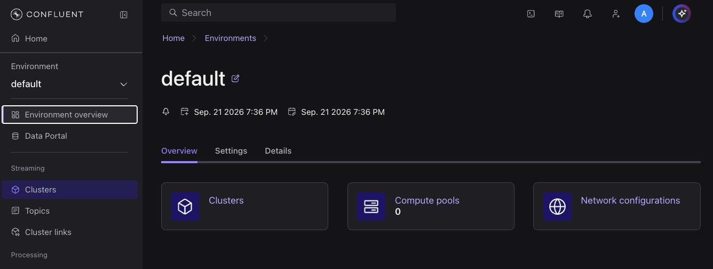
2. Open **Clusters** from the left nav (or the **Clusters** card). The
   environment is brand new, so it has none yet — click **Add new cluster** to
   create your first one.

   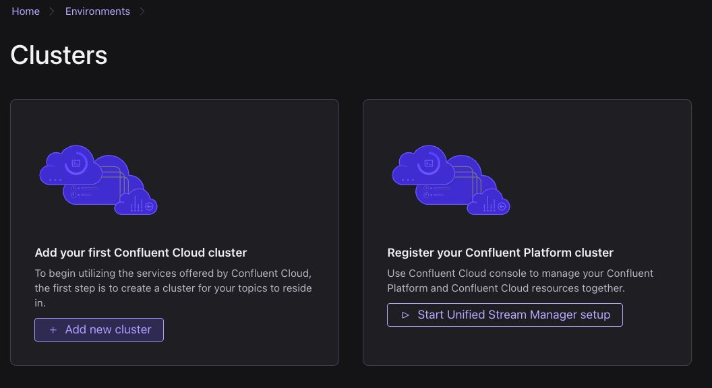
3. On the **Create cluster** page, keep the default configuration — **Standard**
   cluster, **AWS**, region **us-east-2** — and click **Continue**, then
   **Launch cluster**. It shows **Running** once ready.

   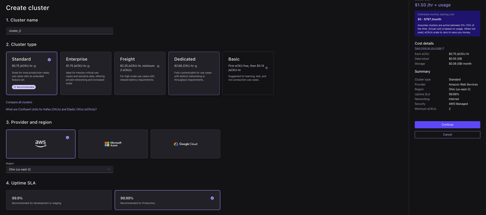

   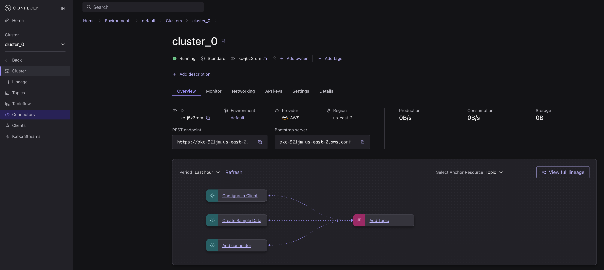

> 🤖 **Ask Bob — size the resources:**
> ```
> What Confluent Cloud resources does this lab need (cluster, Flink compute pool,
> Schema Registry)? I'll create everything and tear it down the same day. Briefly
> compare a Standard vs a Basic Kafka cluster for this lab — which is cheaper to
> leave idle, and does Basic still support Datagen connectors, Flink, and
> ML_FORECAST?
> ```
> *Expected:* a Kafka cluster + a Flink compute pool + Schema Registry; **Basic**
> has no hourly base fee (cheapest to leave idle) and supports everything here,
> while **Standard** (shown in the screenshots) adds a base rate. Either works —
> this manual follows the Standard default so the screenshots match.

---

## 3. Generate Data Sources

You'll stand up two **Sample Data** (Datagen) connectors that stream mock
records into Kafka topics: **Users** (customer profiles — `userid`, `regionid`,
`gender`) and **Stock trades** (live trades — `symbol`, `side`, `quantity`,
`price`, and the trader's `userid`).

> 🤖 **Ask Bob — why AVRO, not JSON:**
> ```
> I'll add two Datagen Source (Sample Data) connectors: the "Users" template to
> topic sample_data_users, and "Stock trades" to sample_data_stock_trades. Why
> should the output value format be AVRO instead of JSON, and what exactly breaks
> in Flink later if I pick schemaless JSON?
> ```
> *Expected:* AVRO registers a schema in Schema Registry, so Flink sees **typed
> columns** (`userid`, `symbol`, `price`, …); schemaless JSON leaves Flink with
> one opaque blob and nothing to join on. **Choose AVRO.**

1. From your cluster, open **Connectors** and click **Add Connector**.
   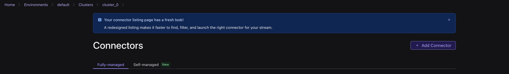
2. Choose the **Sample Data** (Datagen Source) connector and click **Get
   started**.
   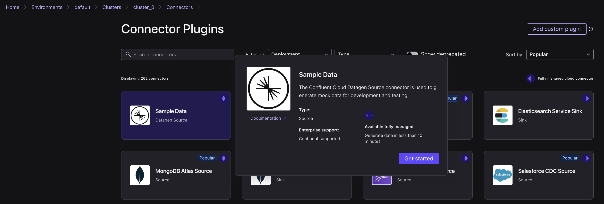
3. Select the **Users** template — it writes to the `sample_data_users` topic —
   set the output format to **AVRO**, then click **Launch**.

   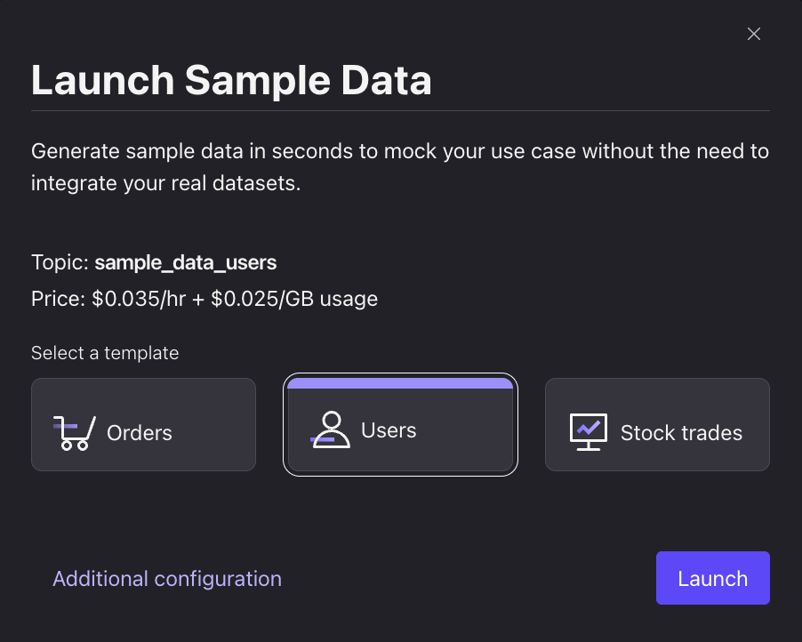
4. Add another connector the same way, select the **Stock trades** template — it
   writes to `sample_data_stock_trades`, output format **AVRO** — then click
   **Launch**.

   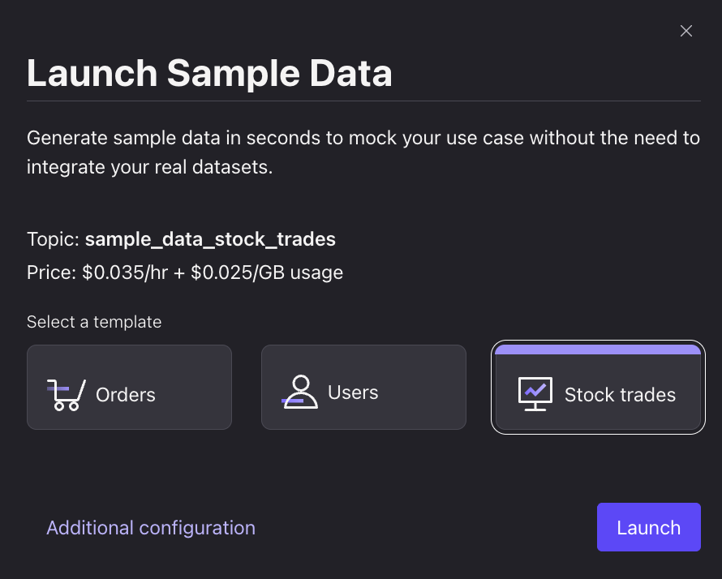
5. Wait until both connectors show **Running**.

   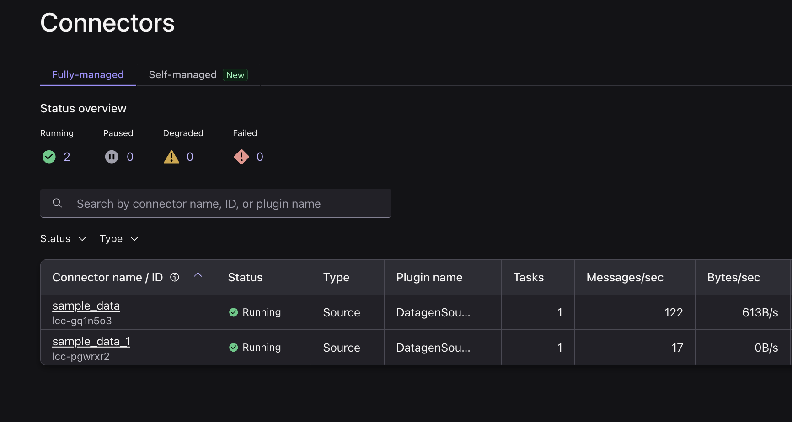
6. From the left nav, open **Topics**.

   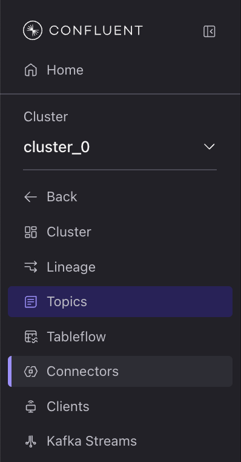
7. Click **sample_data_users**, then open the **Messages** tab to view live user
   records.

   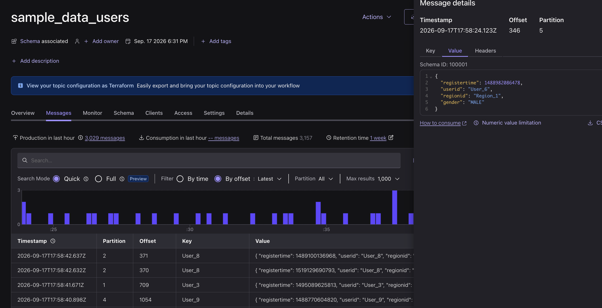
8. Click **sample_data_stock_trades**, open the **Messages** tab, and note the
   shared `userid` field.

   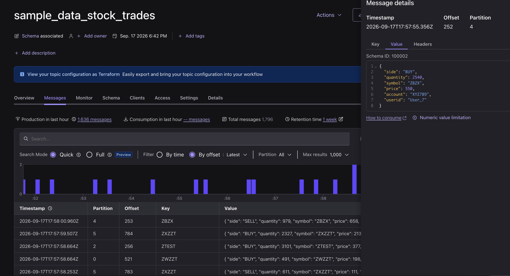

> 🤖 **Ask Bob — what am I looking at:**
> ```
> I'm viewing live messages in sample_data_users and sample_data_stock_trades.
> What fields should each record carry, and which field do the two topics share
> so I can join trades to the user who made them?
> ```
> *Expected:* users carry `userid`/`regionid`/`gender`; trades carry
> `userid`/`symbol`/`side`/`quantity`/`price`; the shared key is **`userid`**.

---

## Lab 2: Enrich & Forecast Live Trades with Flink

With trades and customer data now streaming, use Flink SQL to answer the two
business questions from the use case: **who is trading and from where**
(enrichment), and **which stocks are heating up** (forecast) — both computed
continuously on the live streams.

### Step 1: Enrich Live Trades with Customer Context

1. [Open Flink](https://confluent.cloud/go/flink), select the **default**
   environment, and click **Continue**.

   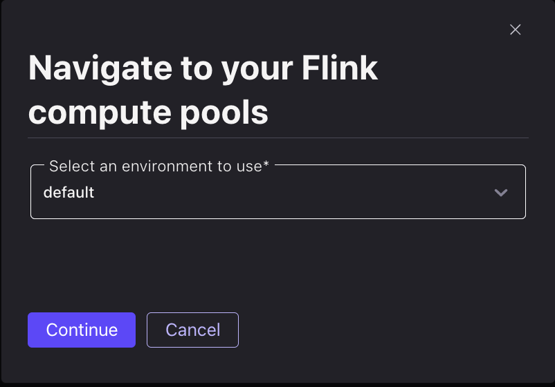
2. Flink runs your SQL on a **compute pool**, and a brand-new environment has
   none. On the **Compute pools** tab, click **Add compute pool**.

   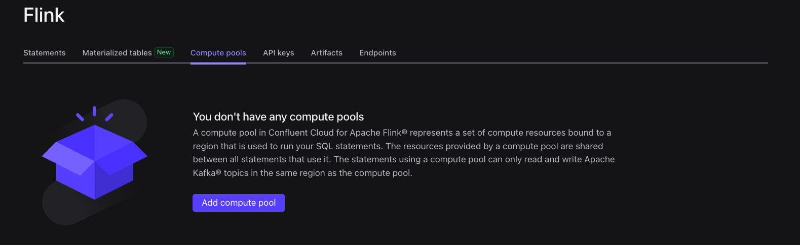
3. Choose **AWS** and region **Ohio (us-east-2)** — a compute pool must be in
   the same cloud and region as the cluster it processes — then click
   **Continue**.

   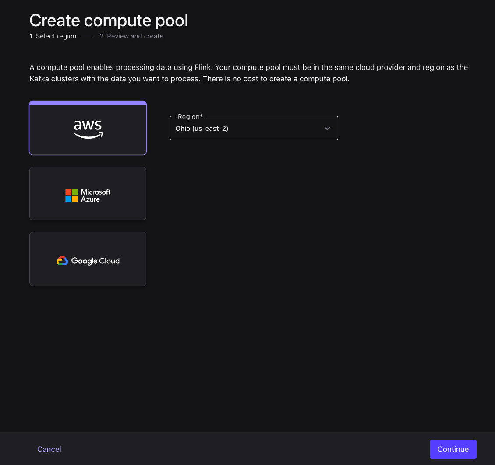
4. Review the pool — the defaults (max **10 CFU**, no base cost) are plenty for
   this workshop — and click **Create**.

   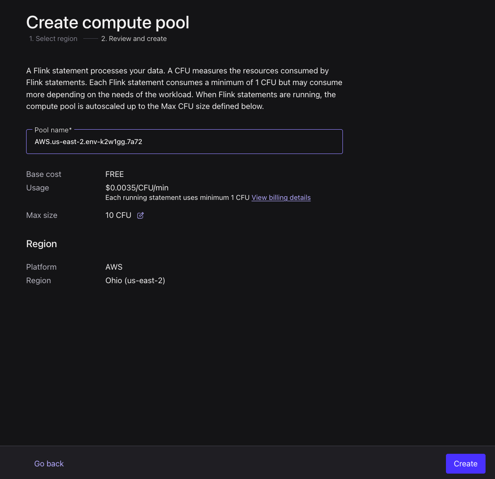
5. Once the pool is ready, click **SQL Workspace** on it to open a query editor.

   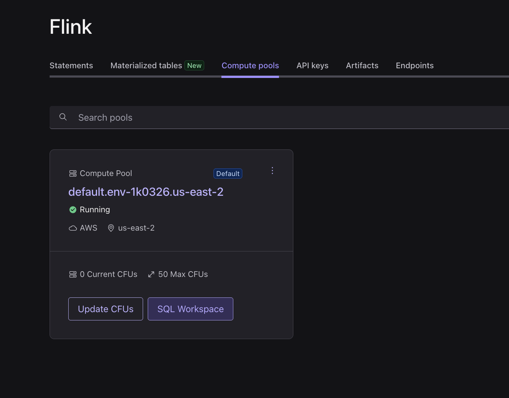

> 🤖 **Ask Bob — why region has to match:**
> ```
> Why must my Flink compute pool be in the same cloud and region as my Kafka
> cluster (AWS us-east-2)? What breaks if they differ, and how would I tell?
> ```
> *Expected:* a pool can only process clusters in its own cloud/region; a
> mismatch means your statements won't see your cluster's topics at all.

6. In the workspace, set **Use catalog** to `default` and **Use database** to
   `cluster_0` so your topics resolve as tables.

   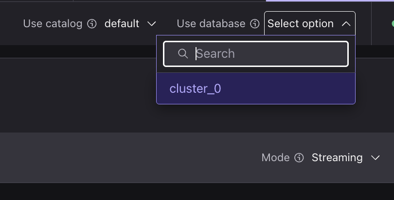

> 🤖 **Ask Bob — the #1 gotcha (catalog & database):**
> ```
> In Confluent Cloud Flink SQL, what do "catalog" and "database" actually map to?
> My environment is named "default" and my cluster is "cluster_0". What should I
> set the current catalog and database to, and give me a one-line query to
> confirm my two source topics are visible.
> ```
> *Expected:* **catalog = environment name**, **database = cluster name** (here
> `default` / `cluster_0`; in your own account they'd be *your* env and cluster
> names, not these defaults). Confirm with:
> ```sql
> SHOW TABLES;
> ```
> You should see `sample_data_users` and `sample_data_stock_trades`.

7. `sample_data_users` from Datagen is an append-only stream, so first key it
   into a lookup table that keeps the latest row per user using a
   [materialized table](https://docs.confluent.io/cloud/current/flink/reference/statements/create-materialized-table.html).

> 🤖 **Ask Bob — generate `users_keyed`:**
> ```
> Create a Confluent Cloud Flink MATERIALIZED TABLE called users_keyed from
> sample_data_users. It should hold userid (primary key, never null), regionid,
> and gender, so I can join trades to the latest profile per user. Give me the
> exact CREATE MATERIALIZED TABLE statement.
> ```
> *Expected — run it:*
> ```sql
> CREATE MATERIALIZED TABLE users_keyed (
>   userid STRING NOT NULL,
>   regionid STRING,
>   gender STRING,
>   PRIMARY KEY (userid) NOT ENFORCED
> ) AS
> SELECT COALESCE(userid, '') AS userid, regionid, gender FROM sample_data_users;
> ```

> A **materialized table** bundles a table and its continuous query into one
> object — define it once, with no separate `INSERT INTO` to manage. You can even
> evolve it in place with `CREATE OR ALTER MATERIALIZED TABLE`.

8. Enrich each trade with its user's region and gender using a **temporal
   join**, storing the result in a `trades_enriched` table the next step
   forecasts on.

> 🤖 **Ask Bob — generate the temporal join:**
> ```
> Create a MATERIALIZED TABLE trades_enriched that joins sample_data_stock_trades
> (fields: userid, symbol, side, quantity, price) to my users_keyed table,
> attaching each user's regionid and gender as of the trade's event time. Use a
> temporal join on the trade's $rowtime.
> ```
> *Expected — run it:*
> ```sql
> CREATE MATERIALIZED TABLE trades_enriched AS
> SELECT t.userid, t.symbol, t.side, t.quantity, t.price, u.regionid, u.gender
> FROM sample_data_stock_trades t
> JOIN users_keyed FOR SYSTEM_TIME AS OF t.`$rowtime` AS u
>   ON t.userid = u.userid;
> ```

9. Query the enriched stream to confirm each trade now carries its customer's
   region and gender:

   ```sql
   SELECT * FROM trades_enriched;
   ```

   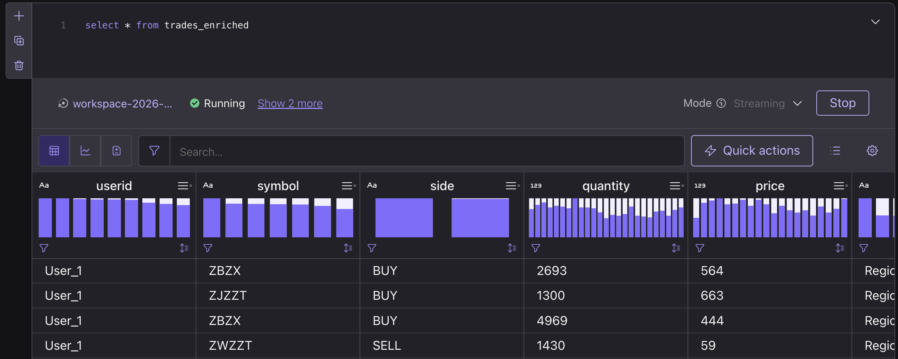

> 🤖 **Ask Bob — if you see zero rows (don't panic):**
> ```
> My Flink temporal join trades_enriched returns 0 rows even though both source
> topics have data. Explain the watermark warm-up, list the other usual causes
> (key mismatch, catalog/database), and tell me how long to wait before deciding
> something is actually wrong.
> ```
> *Expected:* a temporal join emits nothing during watermark warm-up — **wait
> ~30–60s and re-run** before troubleshooting.

---

### Step 2: Forecast Trades per Stock

`ML_FORECAST` needs a real time series (a numeric value per timestamp), so window
`trades_enriched` into a per-stock trade count every 10 seconds and forecast each
symbol on its own — in one statement.

> 🤖 **Ask Bob — generate the forecast table:**
> ```
> Create a MATERIALIZED TABLE trades_forecast that, per stock symbol, counts
> trades in 10-second tumbling windows over trades_enriched, then applies
> ML_FORECAST over that count ordered by window time (minTrainingSize 10,
> horizon 5). Output symbol, the window end as ts, the current count, and the
> next forecast value and its upper bound. Use the TUMBLE table-valued function
> on $rowtime.
> ```

1. Create the forecast as a materialized table. The inner query tumbles trades
   into `trade_count` per `symbol`; `ML_FORECAST` — partitioned by `symbol` —
   returns an **array** of forecast points, so index the first one
   (`forecast[1]`) for the next-window prediction and its confidence bounds
   (`minTrainingSize` is 10 per symbol, so a stock forecasts once it has ~10
   windows of history):

   ```sql
   CREATE MATERIALIZED TABLE trades_forecast AS
   SELECT
     symbol,
     ts,
     trade_count                AS current_count,
     forecast[1].forecast_value AS forecast_count,
     forecast[1].upper_bound    AS upper_bound
   FROM (
     SELECT
       symbol,
       window_end AS ts,
       trade_count,
       ML_FORECAST(
         CAST(trade_count AS DOUBLE),
         window_end,
         JSON_OBJECT('minTrainingSize' VALUE 10, 'horizon' VALUE 5)
       ) OVER (
         PARTITION BY symbol
         ORDER BY window_time
       ) AS forecast
     FROM (
       SELECT symbol, window_end, window_time, COUNT(*) AS trade_count
       FROM TABLE(
         TUMBLE(TABLE trades_enriched, DESCRIPTOR(`$rowtime`), INTERVAL '10' SECONDS)
       )
       GROUP BY symbol, window_start, window_end, window_time
     )
   )
   WHERE CARDINALITY(forecast) >= 1;
   ```

> 🤖 **Ask Bob — explain it (so you can teach it back):**
> ```
> Explain in plain terms what this ML_FORECAST is doing: what do
> minTrainingSize=10 and horizon=5 mean, why do we read forecast[1], and why
> won't a stock produce a forecast until it has about 10 closed windows?
> ```
> *Expected:* `ML_FORECAST` returns an array of future predictions; `forecast[1]`
> is the next window; a symbol needs ~10 closed 10-second windows (~100s) before
> it forecasts; `horizon=5` projects up to 5 windows ahead.

2. Inspect the **latest** forecast for each stock. `trades_forecast` has one row
   per stock *per window*, so deduplicate to the most recent window per `symbol`:

   ```sql
   SELECT symbol, current_count, forecast_count, upper_bound
   FROM (
     SELECT *,
       ROW_NUMBER() OVER (PARTITION BY symbol ORDER BY `$rowtime` DESC) AS row_num
     FROM trades_forecast
   )
   WHERE row_num = 1;
   ```

> 🤖 **Ask Bob — get the result query:**
> ```
> Give me a Flink SQL query over trades_forecast that returns only the most recent
> row per symbol (latest by $rowtime), showing symbol, current_count,
> forecast_count, and upper_bound.
> ```

   You get one row per stock — its latest window — where *count* means **trades
   in a 10-second window**:
   - **`current_count`** — trades that stock had in the latest window (what just
     happened).
   - **`forecast_count`** — trades the model predicts for its next window.
   - **`upper_bound`** — top of the confidence range on that prediction.

   A `forecast_count` above `current_count` means that stock is **heating up**.

   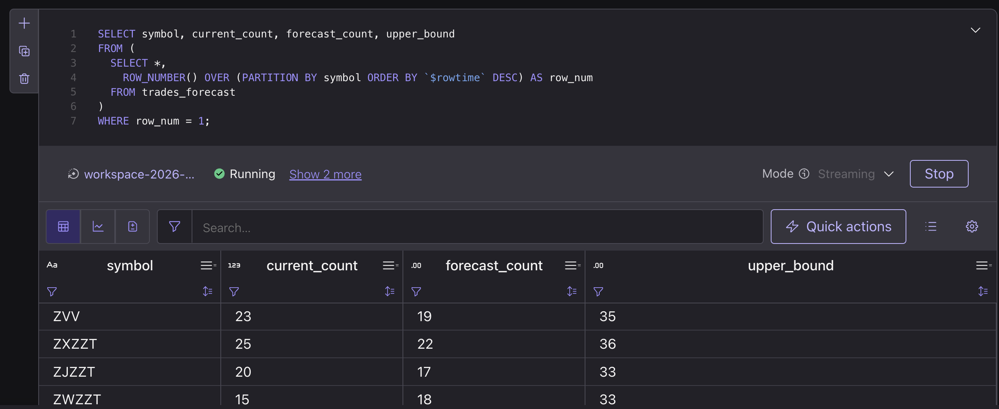

---

## Iterate with Bob (the AI-SDLC loop)

The point of a Bob lab is that you change the *requirement*, not the syntax —
Bob regenerates the SQL. Pick one:

> 🤖 **Break the forecast down by region:**
> ```
> Extend the pipeline: I want the trade-surge forecast per stock AND per regionid
> (from trades_enriched). Give me the modified trades_forecast definition and tell
> me what I must drop/recreate to apply it.
> ```

> 🤖 **Turn it into an always-on alert feed:**
> ```
> Turn the heating-up watch list into its own always-on MATERIALIZED TABLE —
> trades_alerts — that continuously holds only the symbols whose forecast_count is
> at least 25% above current_count, so a downstream consumer could subscribe to
> it. Give me the CREATE MATERIALIZED TABLE statement over trades_forecast.
> ```

---

## Cleanup

Tear everything down so nothing keeps running.

> 🤖 **Ask Bob — tear down OR just park it:**
> ```
> Give me two options to finish: (a) the DROP statements to fully tear down the
> three materialized tables, and (b) the steps to just PARK everything at about
> $0/hour WITHOUT deleting — suspend the three materialized tables and pause both
> Datagen connectors — plus how to resume later.
> ```

**Option A — full teardown (deletes):**

1. In the SQL workspace, drop the Flink materialized tables (this stops their
   continuous statements):

   ```sql
   DROP MATERIALIZED TABLE trades_forecast;
   ```
   ```sql
   DROP MATERIALIZED TABLE trades_enriched;
   ```
   ```sql
   DROP MATERIALIZED TABLE users_keyed;
   ```
2. Delete both **Sample Data** connectors: go to the
   [cluster](https://confluent.cloud/go/cluster) → **Connectors** → each
   connector → **Settings** → **Delete connector**.
3. Delete the **cluster** (Cluster → Settings → Delete cluster). This removes all
   remaining topics.

**Option B — park it without deleting (≈ $0/hour, resume any time):**

```sql
ALTER MATERIALIZED TABLE trades_forecast SUSPEND;
ALTER MATERIALIZED TABLE trades_enriched SUSPEND;
ALTER MATERIALIZED TABLE users_keyed SUSPEND;
```
Then **pause** both Datagen connectors in the Connectors UI. The Flink pool idles
to 0 CFU; on a Basic cluster that's ≈ $0/hour with nothing deleted. Resume =
resume connectors + `ALTER MATERIALIZED TABLE <name> RESUME;` on all three
(`users_keyed` first), then wait ~2 minutes.

> Tearing down (or parking) stops the connectors and Flink statements from
> running against your account.
